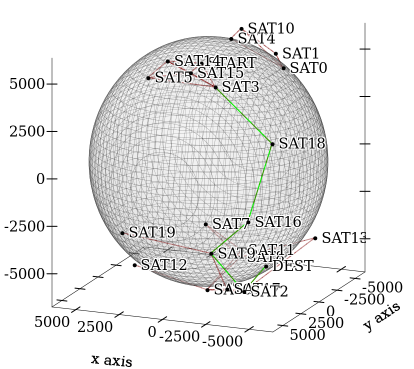

orbital-challenge
-----------------
Solves the [orbital challenge](https://reaktor.com/orbital-challenge/), written in Racket.
It depends on two packages, `graph` and `csv-reading`, probably the second one was superfluous, but hey.

Have a picture of the graph it outputs which was used during dev for visualization.

